# 🏋️‍♀️ Exercise and Nutrition App (.NET MAUI)

> ⚠️ **Important Notice**  
> This application is currently **non-functional** due to the **expiration of the Firebase Realtime Database service trial**. Any feature involving authentication, data storage, or retrieval will not work until the Firebase configuration is reactivated or replaced with an alternative backend.

---

## 📋 Description

This **.NET MAUI** application is developed for tracking fitness and nutrition goals. Users can log meals and physical exercises, monitor their daily progress, and view historical data. Firebase is used for user authentication and data storage, while two external APIs are integrated for additional data retrieval.

### 🔗 Integrated APIs
- **[CalorieNinjas API](https://api.calorieninjas.com):** Retrieves nutritional data for entered food items.
- **[API Ninjas Exercise API](https://api.api-ninjas.com):** Suggests exercises based on user input.

All API keys and Firebase configuration settings are stored securely in property files.

---

## 🏗️ Architecture Overview

The app is structured into several logical components:

- **Views:** UI screens such as login, progress tracking, and data entry pages.
- **Entities:** Data models for representing meals, exercises, and users.
- **Services:** Classes that manage communication with Firebase and external APIs.

The Firebase database is responsible for:
- User account management (email and password-based login)
- Storing logs of meals and exercises

### 🔧 Firebase Database Structure

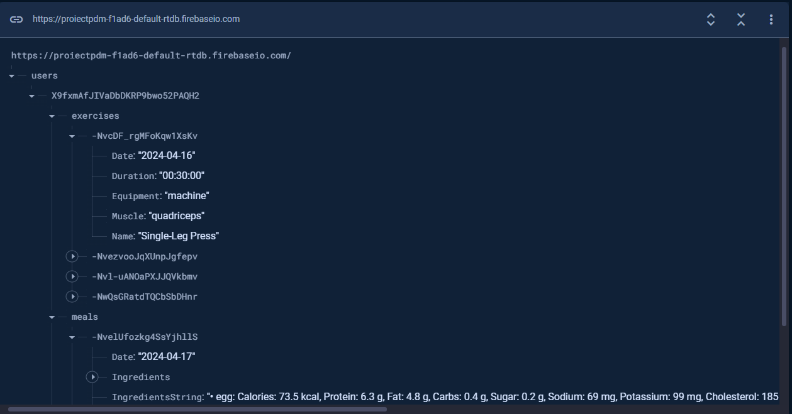

---

## 📱 Application Features & Screens

### 1. 🔐 Login Page

Enables users to register or log in with email and password credentials.

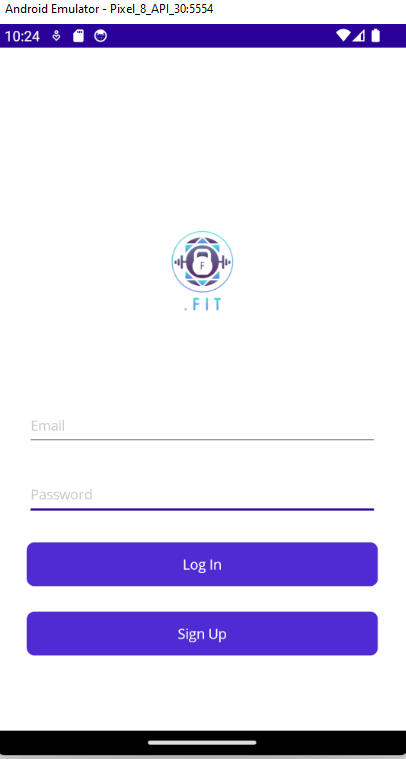

---

### 2. 🏠 Home Page

The home screen displays:
- Logged meals for the current day
- A progress bar showing the percentage of the daily exercise goal achieved
- A water intake tracker where users can record how much water they've consumed

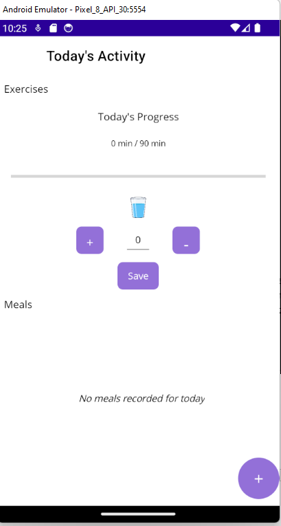
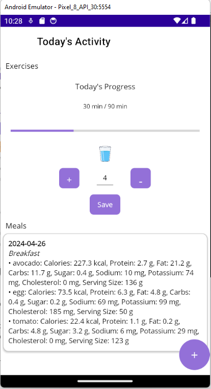

---

### 3. 🍽️ Add Meal Page

Allows users to:
- Choose the meal type (e.g., breakfast, lunch, dinner)
- Enter food items along with quantities

Nutritional values are fetched in real-time using the `NutritionService`.

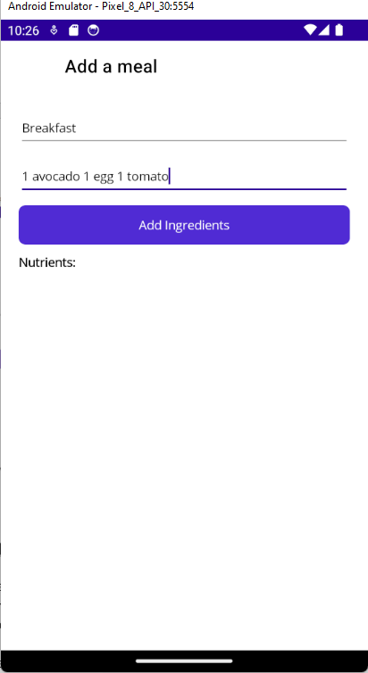
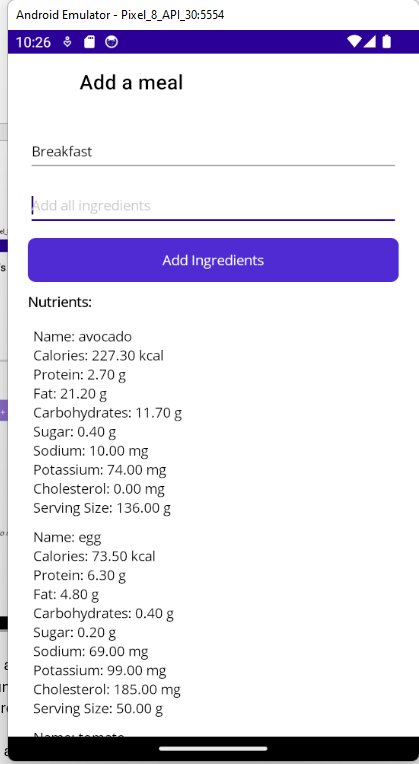

---

### 4. 🏃 Add Exercise Page

Users can:
- Enter a partial exercise name and receive up to 10 suggested matches
- Use a `TimePicker` to set the duration of the exercise

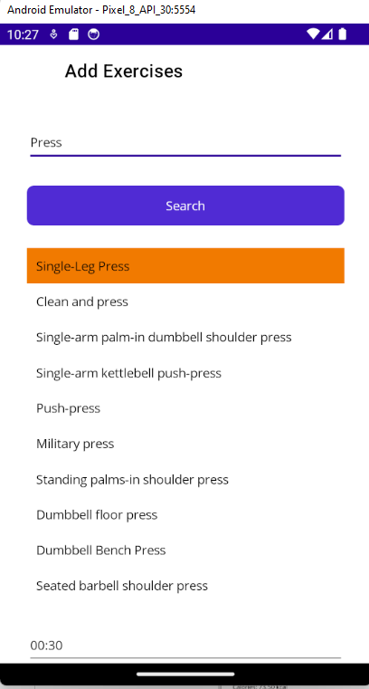
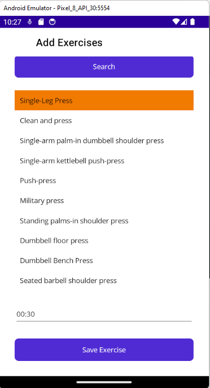

---

### 5. 📆 Meal History

Displays a complete list of meals logged by the current user, sorted chronologically.

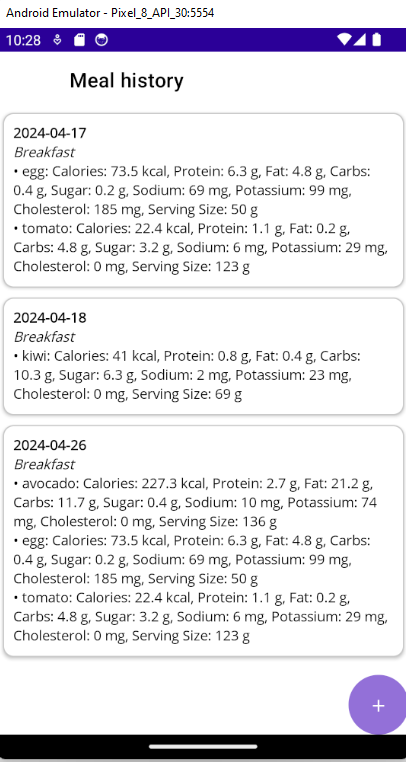

---

### 6. 📈 Exercise History

Shows all exercises performed by the user, along with their durations.

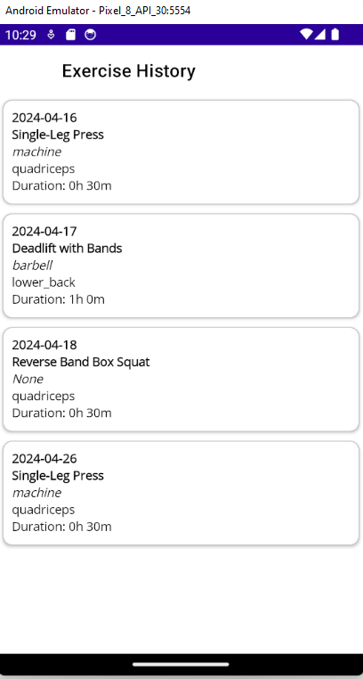

---

### 7. 👤 User Profile

Contains settings for:
- Daily calorie goals
- Daily exercise duration targets

These targets are used to calculate and display progress on the Home Page.

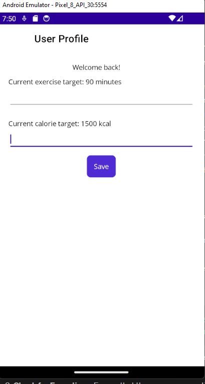

---

## 🛠️ Technologies Used

- **.NET MAUI** – Cross-platform mobile/desktop UI
- **C# & XAML** – Core language and UI markup
- **Firebase Realtime Database** – Cloud backend for authentication and data storage
- **CalorieNinjas API** – Nutrition information
- **API Ninjas Exercise API** – Exercise data suggestions
- **MVVM Architecture** – Clean separation of logic and UI

---

